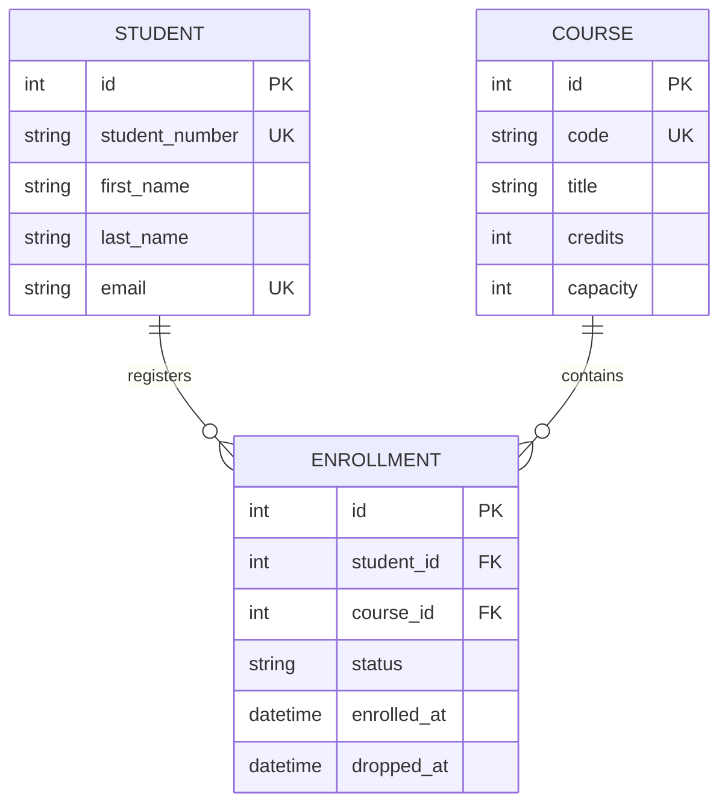
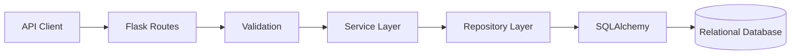
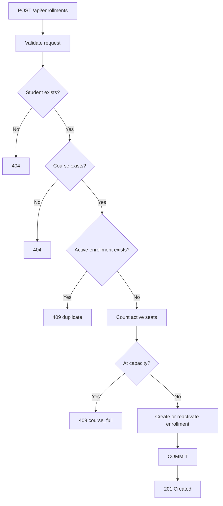

# Course Registration REST API

> Flask REST API for managing students, courses, and enrollments with normalized relational modeling, transactional registration workflows, integrity constraints, search, pagination, and automated tests.

[](https://perpsakach.github.io/)


## Overview

This project models course registration as a relational backend problem rather than storing enrollment state inside ad hoc lists or comma-separated fields.

The central many-to-many relationship is resolved through an `Enrollment` entity:

```text
Student 1 ---- * Enrollment * ---- 1 Course
```

That design allows registration to carry its own lifecycle data such as status and timestamps.

## Domain model



Database-level integrity includes:

```text
UNIQUE(student_id, course_id)
```

so duplicate relationships cannot be created even if application code fails.

## Layered architecture



### Responsibilities

- **Routes** — HTTP requests, JSON, query parameters, status codes
- **Validation** — field format and input constraints
- **Services** — business rules and transaction workflows
- **Repositories** — database queries
- **Models** — relational structure and database constraints

## Core endpoints

```text
GET/POST          /api/students
GET/PATCH/DELETE  /api/students/<id>
GET               /api/students/<id>/courses

GET/POST          /api/courses
GET/PATCH/DELETE  /api/courses/<id>
GET               /api/courses/<id>/students

GET/POST          /api/enrollments
GET/DELETE        /api/enrollments/<id>
```

## Registration workflow



## HTTP semantics

| Situation | Status |
|---|---:|
| Successful read/update | 200 |
| Resource created | 201 |
| Resource deleted | 204 |
| Invalid request field | 400 |
| Resource not found | 404 |
| Duplicate/full/conflicting state | 409 |

Using `409 Conflict` for a full course is intentional: the request may be structurally valid, but it conflicts with the current resource state.

## Integrity and transactions

Each modifying workflow follows the pattern:

```text
BEGIN
  validate
  query
  enforce business rules
  modify
  flush
COMMIT
```

and rolls back on failure.

Application checks improve error messages, while database unique/foreign-key constraints remain the authoritative integrity layer.

## Capacity logic

The API prevents:

- enrolling beyond tracked capacity;
- duplicate active registration;
- reducing course capacity below current active enrollment.

A high-concurrency production implementation would add stronger seat-allocation concurrency control such as row locking or serializable transactions.

## Search and pagination

Examples:

```text
GET /api/students?search=amina&limit=25&offset=0
GET /api/courses?search=database
GET /api/enrollments?status=active&course_id=3
```

## Quick start

```bash
pip install -r requirements.txt
flask --app run.py init-db
flask --app run.py seed-db
flask --app run.py run --debug
```

Run tests:

```bash
pytest -q
```

## What this project demonstrates

- Flask backend engineering
- REST API design
- SQL / relational normalization
- many-to-many relationships
- transactions and constraints
- validation and structured errors
- CRUD workflows
- search and pagination
- automated testing
- separation of concerns

## Production extensions

A larger university system would add:

- authentication and role-based authorization;
- semesters and course sections;
- prerequisites;
- waitlists;
- schedule-conflict detection;
- registration windows;
- migrations and OpenAPI documentation;
- concurrency-safe seat allocation.

## Provenance

The historical project is recovered at the **Python + Flask + SQL + student/course/registration + CRUD + REST-style architecture** level. Exact historical endpoints, database engine, and source bytes are not currently available.

See [`PROVENANCE.md`](PROVENANCE.md) for the recovered/reconstructed/enhanced breakdown.

## Portfolio

Explore the complete technical portfolio at **[perpsakach.github.io](https://perpsakach.github.io/)**.