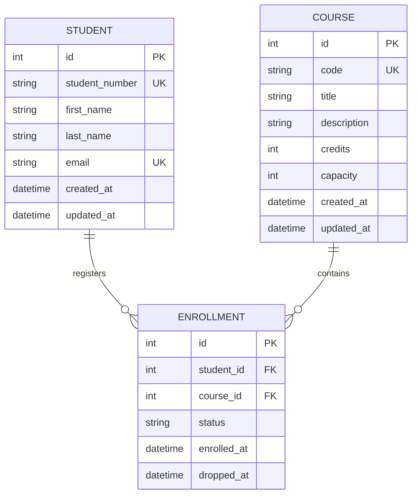
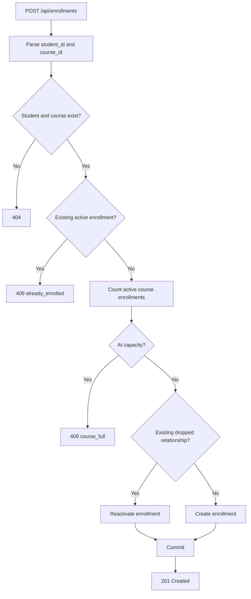
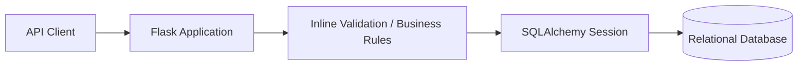

# Course Registration REST API

> Flask REST API for managing students, courses, and enrollments with normalized relational modeling, database constraints, duplicate-enrollment prevention, capacity validation, and basic API tests.

[](https://perpsakach.github.io/)


## Overview

This project models course registration as a relational backend problem. Students and courses are connected through an `Enrollment` entity rather than embedding registration data inside either parent record.

```text
Student 1 ---- * Enrollment * ---- 1 Course
```

The current public implementation is intentionally compact. It demonstrates the core data model, student/course creation and listing, enrollment creation/reactivation, duplicate prevention, capacity checks, and testable Flask endpoints.

## Domain model



Database-level integrity includes:

- unique `student_number`
- unique student `email`
- unique course `code`
- positive course `credits`
- positive course `capacity`
- unique `(student_id, course_id)` enrollment relationship
- enrollment status constrained to `active` or `dropped`
- foreign keys from enrollment to student and course

## Current public endpoints

The repository currently implements:

```text
GET  /api/health

POST /api/students
GET  /api/students

POST /api/courses
GET  /api/courses

POST /api/enrollments
```

### Student creation

`POST /api/students` validates required fields and returns conflict responses for duplicate student numbers or email addresses.

### Course creation

`POST /api/courses` validates course code/title plus positive numeric `credits` and `capacity` values. Course codes are normalized to uppercase.

### Enrollment creation

`POST /api/enrollments`:



The capacity check is useful for demonstrating business-rule enforcement, but it is not concurrency-safe for a high-volume production registration system because it uses a count-then-insert pattern without row locking or serializable seat allocation.

## Current architecture

The present public implementation is deliberately small:



The code currently keeps route handling, validation, and most business rules in `app/__init__.py`; the relational model is defined in `app/models.py`, and database/session configuration is separated into `app/db.py`.

This is **not currently a full route/service/repository architecture**. That broader architecture remains a reasonable future extension, but the README does not present it as already implemented.

## Tests currently included

The repository includes pytest coverage for:

- health endpoint response
- creating a student
- creating a course
- creating an enrollment
- verifying an enrollment is returned as `active`

The test suite is present in the repository. This README does not claim that the suite has been executed successfully in every environment.

## Quick start

```bash
pip install -r requirements.txt
flask --app run.py init-db
flask --app run.py run --debug
```

Run tests:

```bash
pytest -q
```

There is currently **no `seed-db` CLI command** in the public implementation.

## Current implementation limits

The public repository does **not currently implement**:

- PATCH/DELETE student endpoints
- PATCH/DELETE course endpoints
- GET/DELETE enrollment-by-id endpoints
- student-to-course or course-to-student lookup endpoints
- search
- pagination
- authentication or authorization
- semester/section modeling
- prerequisite rules
- waitlists
- registration windows
- schedule-conflict detection
- concurrency-safe seat allocation

Those are documented as future extensions rather than current capabilities.

## What this project demonstrates today

- Flask REST endpoint development
- SQLAlchemy 2.x relational modeling
- many-to-many relationship resolution through an association entity
- uniqueness and check constraints
- validation and structured HTTP errors
- duplicate registration prevention
- basic capacity enforcement
- reusable database/session configuration
- pytest-based API testing

## Provenance

The historical project is recovered only at a broad level: **Python + Flask + SQL + student/course/registration + CRUD/REST-style coursework**. I did not find an earlier course artifact in the currently available files that proves the exact historical endpoints, schema, database engine, or source implementation.

The code in this repository is therefore explicitly treated as a **reconstruction**, with current implemented behavior documented separately from future enhancements.

See [`PROVENANCE.md`](PROVENANCE.md) and [`IMPLEMENTATION_STATUS.md`](IMPLEMENTATION_STATUS.md).

## Portfolio

Explore the complete technical portfolio at **[perpsakach.github.io](https://perpsakach.github.io/)**.